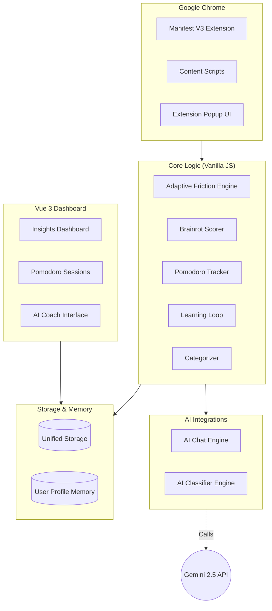
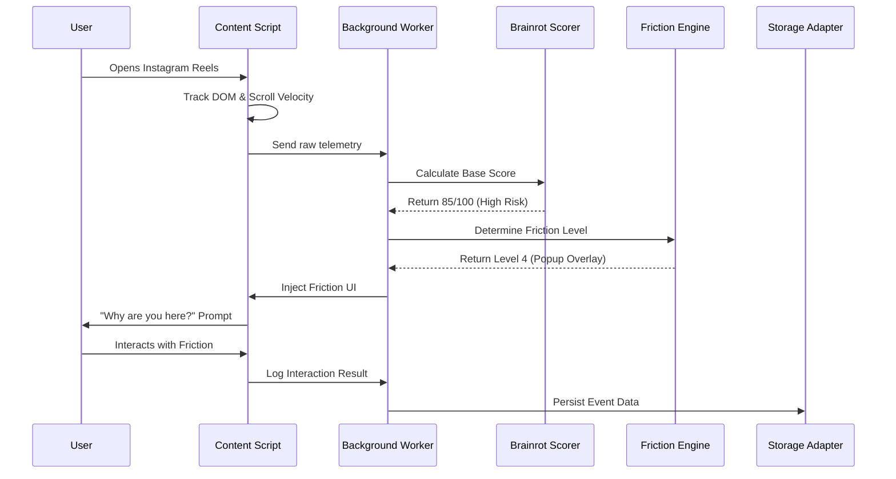
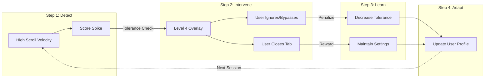
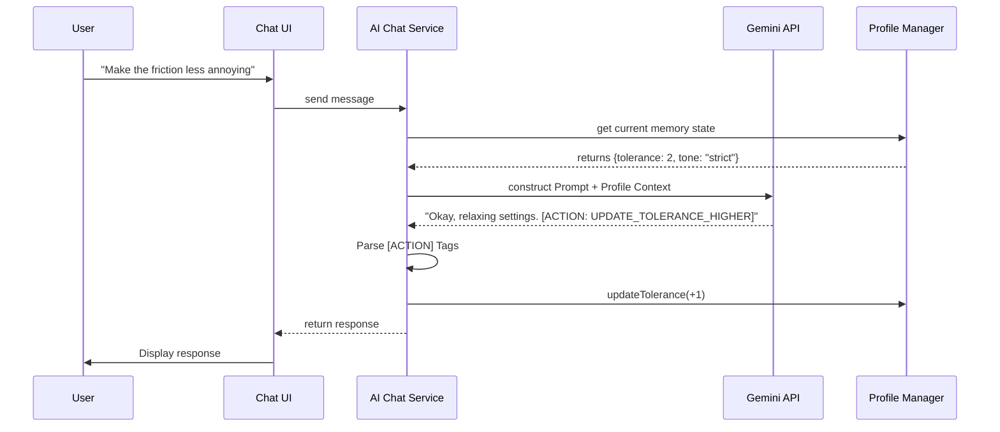
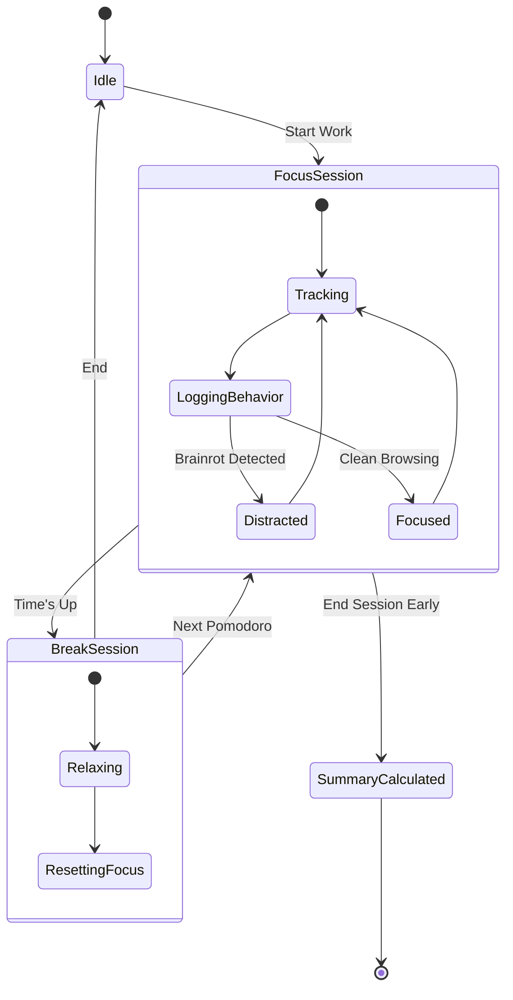

# 🏛 Study Friction AI — System Architecture & Design Document

This document provides a comprehensive overview of the **Study Friction AI** system design, detailing its modular architecture, core engines, AI integrations, data flow, and file-by-file breakdowns. It synthesizes the original blueprints (`plan.md`, `architecture_part1.md`, `architecture_part2.md`) and maps them to the implemented MVP.

---

## 🚀 1. System Overview

**Study Friction AI** is a local-first Pomodoro Attention OS designed to actively reshape user attention through adaptive "friction." Rather than simply hard-blocking websites, the system introduces measured resistance (e.g., scroll delays, intention popups) when users enter "brainrot" patterns. The system adapts its strictness based on the user's ongoing behavior and feedback via an AI Coach.

### 🧩 Core Components Architecture Diagram

---

## 🔄 2. Data Flow & Lifecycle

The data lifecycle connects the user's browsing behavior directly to the intervention overlays and finally to the dashboard analytics.

---

## 📂 3. Directory & File Breakdown

The project is strictly modular, allowing the core logic to be agnostic of the UI framework.

### 📌 Extension Core (`extension/`)
Handles all browser-level integrations (Manifest V3).

*   `manifest.json`: Defines permissions (`storage`, `tabs`), background worker, and content scripts targeting specific domains.
*   `background.js`: The central message bus. Monitors tab URLs, matches them against patterns, and coordinates configurations.
*   `content/detector.js`: Monitors DOM mutations, scroll velocity, and time spent.
*   `content/friction.js`: Receives friction levels and applies interventions (CSS delays, blocking overlays).
*   `content/friction.css`: Contains the CSS for the injected friction overlays.
*   `popup/popup.html` & `popup.js`: The mini-UI accessible via the extension icon.

### 📌 UI Framework & Dashboard (`src/`)
Built with Vue 3, Vite, Tailwind CSS v4, and Pinia.

*   `main.js`: Initializes Vue, Pinia, and Vue Router (using `createWebHashHistory`).
*   `App.vue`: The root component containing the application layout.
*   `style.css`: The global CSS containing the Tailwind v4 `@theme` definitions.
*   **Views (`src/views/`)**: `LandingView.vue`, `DashboardView.vue`, `SessionsView.vue`, `InsightsView.vue`, `ChatView.vue`.
*   **Stores (`src/stores/`)**: `sessionStore.js`, `profileStore.js`, `chatStore.js`.
*   **Components (`src/components/`)**: `PomodoroTimer.vue`, `BrainrotChart.vue`.

### 📌 Core Logic (`logic/`)
Pure, framework-agnostic business logic.

*   `brainrotScorer.js`: Calculates a "Brainrot Score" (0-100) based on raw metrics.
*   `categorizer.js`: Rule-based system mapping known URLs to categories. Defers to AI if unknown.
*   `adaptiveFriction.js`: Maps Brainrot Scores to a "Friction Level" (1: None, 2: Delay, 3: Warning, 4: Hard Prompt, 5: Lockout).
*   `pomodoroEngine.js`: Manages the lifecycle of a focus session.
*   `learningLoop.js`: Evaluates completed sessions to determine if the baseline friction settings should be adjusted.

### 📌 Storage & Memory (`storage/` & `profile/`)
*   `storageAdapter.js`: A unified key-value interface wrapping `localStorage` (syncs with `chrome.storage`).
*   `profileManager.js`: Manages the persistent AI User Profile (`sf_profile`).

### 📌 AI Integration (`services/`)
Handles all external LLM processing via the **Google Gemini API**.

*   `aiPrompts.js`: Contains JSON-structured prompt templates (`classifyPrompt`, `summarizePrompt`, `chatPrompt`).
*   `aiClassifier.js`: A hybrid classification tool (Cache -> Rules -> AI Fallback).
*   `aiChat.js`: Orchestrates the chat with the AI Coach and parses Action outputs.

---

## 🧠 4. AI Learning Loop & Adaptive Friction Flow

The system's standout feature is that it continuously learns from the user's responses to interventions.

---

## 💬 5. AI Coach Chat Interaction Flow

The chat engine doesn't just talk; it alters system behavior using embedded Action Tags.

---

## ⏱️ 6. Pomodoro Session Lifecycle

How focus and break sessions track data internally.

---

## 🛠️ 7. Scalability & Future Roadmap

* **Database Swap:** Because all data operations route through `storageAdapter.js`, migrating to Supabase or Firebase simply requires writing a new adapter class.
* **Cross-Device Sync:** The `profileManager.js` data object can easily be synced to the cloud, allowing the AI's understanding of the user to persist across desktop and mobile browsers.
* **Advanced Metrics:** `detector.js` can be expanded to monitor DOM elements specific to new addiction-engineered platforms.

---
*Document generated for the Study Friction AI Hackathon MVP.*
