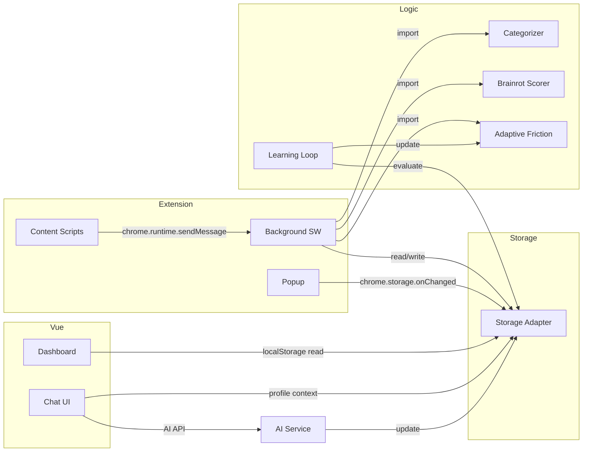
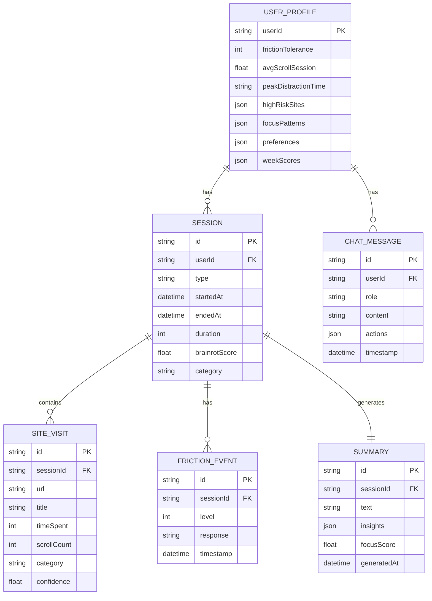
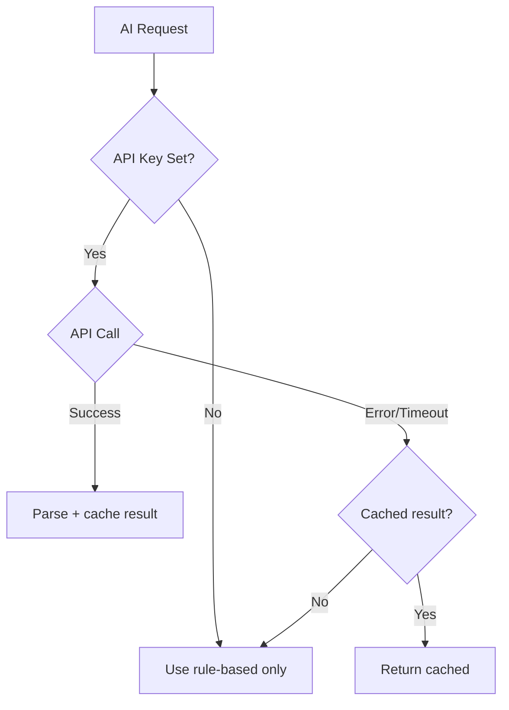
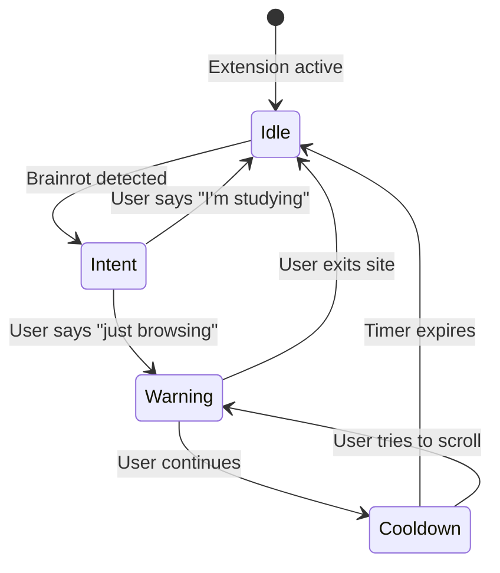
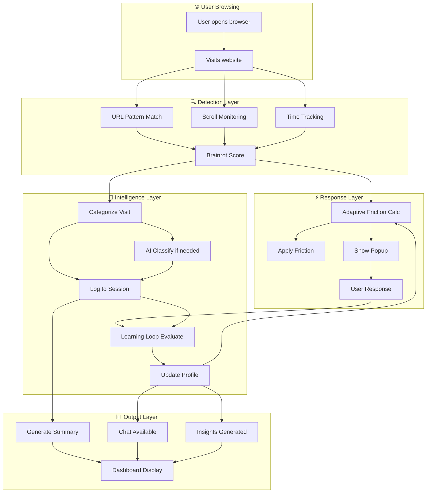
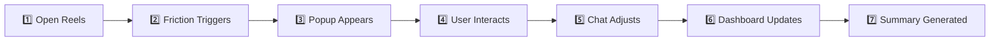

# 🚀 Study Friction AI — Architecture Blueprint (Part 2: Phases 10–17)

---

# PHASE 10: 2-DAY BUILD PLAN

## Day 1 — Foundation (8 hours)

```mermaid
gantt
    title Day 1 - Foundation
    dateFormat HH:mm
    axisFormat %H:%M
    
    section P1 Extension
    Manifest + service worker     :p1a, 09:00, 1h
    Content script + URL detect   :p1b, after p1a, 2h
    Scroll detection + friction   :p1c, after p1b, 2h
    Basic popup HTML/JS           :p1d, after p1c, 2h
    Extension ↔ storage bridge    :p1e, after p1d, 1h

    section P2 Logic
    Storage adapter (local)       :p2a, 09:00, 1h
    Categorizer (rule-based)      :p2b, after p2a, 1h
    Brainrot scorer               :p2c, after p2b, 1h
    Pomodoro engine               :p2d, after p2c, 2h
    Profile schema + manager      :p2e, after p2d, 2h
    Learning loop (basic)         :p2f, after p2e, 1h

    section P3 UI
    Vue + Vite + Tailwind setup   :p3a, 09:00, 1h
    Router + layout shell         :p3b, after p3a, 1h
    Dashboard view (stats)        :p3c, after p3b, 2h
    Pomodoro timer component      :p3d, after p3c, 2h
    Sessions list view            :p3e, after p3d, 2h
```



## Day 2 — Intelligence + Polish (8 hours)

```mermaid
gantt
    title Day 2 - Intelligence + Polish
    dateFormat HH:mm
    axisFormat %H:%M
    
    section P1 Extension
    Adaptive friction integration :p1a, 09:00, 2h
    Cooldown overlay UI           :p1b, after p1a, 2h
    Popup polish + animations     :p1c, after p1b, 2h
    End-to-end testing            :p1d, after p1c, 2h

    section P2 Logic
    AI classifier (API + fallback):p2a, 09:00, 2h
    Summary engine                :p2b, after p2a, 2h
    Chat engine                   :p2c, after p2b, 2h
    Full learning loop            :p2d, after p2c, 2h

    section P3 UI
    Brainrot chart + insights     :p3a, 09:00, 2h
    Chat interface                :p3b, after p3a, 2h
    Landing page                  :p3c, after p3b, 2h
    Final polish + responsive     :p3d, after p3c, 2h
```



---

# PHASE 11: INTEGRATION STRATEGY

## Connection Map



## Integration Points

| From → To | Mechanism | Data Format |
|-----------|-----------|-------------|
| Content Script → Background | `chrome.runtime.sendMessage` | `{ type, payload }` |
| Background → Storage | Direct import of storageAdapter | JS objects |
| Extension → Vue Dashboard | Shared `localStorage` keys | JSON strings |
| Chat → Profile → Friction | Function calls through profileManager | Profile object |
| AI API → Services | `fetch()` with JSON body | OpenAI-compatible |

## Message Protocol (Extension Internal)

```javascript
// Content → Background
{ type: 'BRAINROT_DETECTED', payload: { url, score, scrollCount } }
{ type: 'FRICTION_RESPONSE', payload: { action: 'continue'|'exit', duration } }
{ type: 'SESSION_UPDATE',    payload: { url, timeSpent, category } }

// Background → Content
{ type: 'APPLY_FRICTION',    payload: { level, config } }
{ type: 'SHOW_POPUP',        payload: { type: 'warning'|'cooldown'|'intent' } }
```

---

# PHASE 12: DATA MODEL

## Entity Relationship



## localStorage Key Map (MVP)

| Key | Type | Content |
|-----|------|---------|
| `sf_profile` | Object | UserProfile |
| `sf_sessions` | Array | Last 100 sessions |
| `sf_visits` | Array | Last 500 site visits |
| `sf_friction_log` | Array | Last 200 friction events |
| `sf_summaries` | Array | Last 30 summaries |
| `sf_chat_history` | Array | Last 50 messages |
| `sf_chat_memory` | Object | Key preferences extracted |

---

# PHASE 13: AI API INTEGRATION

## Service Architecture

```javascript
// services/aiPrompts.js
export const PROMPTS = {
  classify: (url, title, time, scrolls) => ({
    model: 'gpt-3.5-turbo',
    messages: [{
      role: 'system',
      content: 'Classify browsing activity. Return JSON only: { "category": "productivity|learning|entertainment|timeWaste|brainrot", "confidence": 0.0-1.0, "reason": "..." }'
    }, {
      role: 'user',
      content: `URL: ${url}\nTitle: ${title}\nTime: ${time}s\nScrolls: ${scrolls}`
    }],
    max_tokens: 100
  }),

  summarize: (sessions, profile) => ({
    model: 'gpt-3.5-turbo',
    messages: [{
      role: 'system',
      content: `Summarize focus session. User goal: ${profile.preferences.goal}. Tone: ${profile.preferences.tone}. Return JSON: { "summary": "...", "insights": ["..."], "focusScore": 0-100 }`
    }, {
      role: 'user',
      content: `Sessions: ${JSON.stringify(sessions.slice(-5))}`
    }],
    max_tokens: 300
  }),

  chat: (message, profile, history) => ({
    model: 'gpt-3.5-turbo',
    messages: [
      { role: 'system', content: `You are a focus coach. Profile: ${JSON.stringify(profile)}. Be ${profile.preferences.tone}. If user wants settings changed, add ACTION line: ACTION:{"field":"value"}. Under 100 words.` },
      ...history.slice(-5),
      { role: 'user', content: message }
    ],
    max_tokens: 200
  })
};
```

## Fallback Strategy



| Scenario | Fallback |
|----------|----------|
| No API key | Rules only, no summaries, chat disabled |
| API timeout (>5s) | Return cached or rule-based |
| Rate limited | Queue + exponential backoff |
| Invalid response | Parse error → use heuristic |

---

# PHASE 14: UI/UX FLOW

## Extension Popup States



**Popup Screens:**

| Screen | Content | Actions |
|--------|---------|---------|
| **Intent** | "What are you doing here?" | "Studying" / "Just browsing" / "Taking a break" |
| **Warning** | "You've been scrolling for {n}min. Brainrot score: {s}" | "I'll stop" / "5 more minutes" |
| **Cooldown** | Countdown timer + motivational quote | Wait or close tab |

## Dashboard Layout

```
┌─────────────────────────────────────────────┐
│  📊 Dashboard  │  ⏱ Sessions  │  💡 Insights  │  💬 Chat  │
├─────────────────────────────────────────────┤
│  ┌──────────┐  ┌──────────┐  ┌──────────┐  │
│  │ Focus    │  │ Brainrot │  │ Pomodoro │  │
│  │ Score    │  │ Score    │  │ Count    │  │
│  │   78     │  │   35     │  │   6/8    │  │
│  └──────────┘  └──────────┘  └──────────┘  │
│                                             │
│  ┌─────────────────────────────────────┐    │
│  │  Weekly Focus vs Brainrot Chart     │    │
│  │  ▓▓▓▓▓▓░░░░  ▓▓▓▓▓▓▓░░  ▓▓▓░░░░░  │    │
│  └─────────────────────────────────────┘    │
│                                             │
│  ┌─────────────────────────────────────┐    │
│  │  Recent Sessions                    │    │
│  │  • Focus 25min - Score 85 ✅        │    │
│  │  • Brainrot 12min - Reels ⚠️       │    │
│  └─────────────────────────────────────┘    │
└─────────────────────────────────────────────┘
```

## Chat Interface

```
┌──────────────────────────────────┐
│  🤖 Focus Coach                  │
├──────────────────────────────────┤
│                                  │
│  👤 Why am I always distracted   │
│     at night?                    │
│                                  │
│  🤖 Your data shows 73% of your │
│     brainrot happens between     │
│     9PM-midnight. You've ignored │
│     friction 8 times this week   │
│     during those hours.          │
│                                  │
│  [Be stricter] [Show stats]     │
│                                  │
├──────────────────────────────────┤
│  Type a message...        [Send] │
└──────────────────────────────────┘
```

## Landing Page Sections

| Section | Content |
|---------|---------|
| **Hero** | "Stop Doomscrolling. Start Focusing." + demo GIF |
| **Problem** | Stats about attention + brainrot |
| **Solution** | 3 feature cards with icons |
| **How It Works** | 4-step visual flow |
| **Dashboard Preview** | Screenshot of dashboard |
| **CTA** | "Download Extension" + "Try Dashboard" |

---

# PHASE 15: FINAL SYSTEM RECOMPOSITION

## Complete Lifecycle



## Module Interaction Matrix

| Module | Reads From | Writes To |
|--------|-----------|-----------|
| Extension Core | Chrome APIs | Brainrot Detect, Session Tracker |
| Brainrot Detect | URLs, scroll events | Friction Engine |
| Friction Engine | Adaptive Friction config | DOM, Friction Events log |
| Session Tracker | Timer, browsing events | Storage |
| Categorizer | URL rules | Session records |
| AI Classifier | Unknown URLs | Categorizer cache |
| Adaptive Friction | Profile, brainrot score | Friction Engine |
| Learning Loop | Friction events, sessions | Profile |
| Profile Memory | All engines | All engines |
| Chat Engine | User input, profile | Profile, Friction config |
| Summary Engine | Sessions, profile | Storage |
| Dashboard | Storage | User display |

---

# PHASE 16: DEMO FLOW

## 7-Step Demo Script



| Step | What Happens | What to Show |
|------|-------------|-------------|
| **1** | User navigates to instagram.com/reels | Browser with extension icon active |
| **2** | After 3 scrolls, friction activates: scroll slows down | Visible lag + subtle overlay appearing |
| **3** | Intent popup: "What are you doing here?" | Popup with 3 intent buttons |
| **4** | User picks "Just browsing" → Warning popup with brainrot score | Score visualization + "I'll stop" button |
| **5** | User opens chat: "Why am I always here?" → AI responds with data | Chat UI with personalized response |
| **6** | Dashboard shows session logged, chart updated | Real-time stat update |
| **7** | "Your evening session: 12min on Reels, brainrot score 78" | Summary card with insights |

---

# PHASE 17: SIMPLIFICATION STRATEGY

## What to Build vs Skip vs Fake

| Feature | Strategy | Details |
|---------|----------|---------|
| Scroll friction | **BUILD** | Core differentiator, must work |
| URL detection | **BUILD** | Simple regex, essential |
| Pomodoro timer | **BUILD** | Standard, well-understood |
| Rule-based categorization | **BUILD** | Static rules, no API needed |
| localStorage persistence | **BUILD** | Native browser API |
| Dashboard charts | **BUILD** | Use Chart.js, minimal setup |
| Popup UI | **BUILD** | HTML/CSS/JS in extension |
| AI classification | **FAKE if needed** | Hardcode responses for demo |
| AI summaries | **FAKE if needed** | Template-based string generation |
| AI chat | **FAKE if needed** | Pre-scripted responses + templates |
| Learning loop | **SIMPLIFY** | Basic if/else, no ML |
| User profile | **SIMPLIFY** | Flat JSON, no versioning |
| Supabase integration | **SKIP** | Stub only, implement post-MVP |
| Auth/accounts | **SKIP** | Local-only for MVP |
| Mobile responsive dashboard | **SKIP** | Desktop-first for demo |
| Cross-browser support | **SKIP** | Chrome only |

## Fallback Tiers

```
Tier 1 (No API): Rules + templates + hardcoded chat
Tier 2 (API available): Real classification + summaries
Tier 3 (Full): Learning loop + adaptive chat + profile evolution
```

## Demo-Critical Path (Minimum Viable Demo)

> [!IMPORTANT]
> These 6 things MUST work for a convincing demo:

1. Extension detects brainrot URL → overlay appears
2. Popup asks intent → user responds
3. Friction applies (scroll delay visible)
4. Pomodoro timer works in dashboard
5. One chart shows focus vs brainrot
6. Summary text appears after session

Everything else enhances but isn't required.

---

# KEY ARCHITECTURAL DECISIONS

| Decision | Choice | Rationale |
|----------|--------|-----------|
| State management | Pinia | Vue 3 standard, simple API |
| Extension ↔ Dashboard data | Shared localStorage | No server needed for MVP |
| AI integration | Optional layer | System works without AI |
| Friction calculation | Client-side only | Zero latency, privacy |
| Profile storage | Single JSON blob | Simple read/write, easy migration |
| Chart library | Chart.js | Lightweight, good defaults |
| CSS framework | Tailwind | Rapid prototyping, consistent design |
| Build tool | Vite | Fast, Vue-native |
